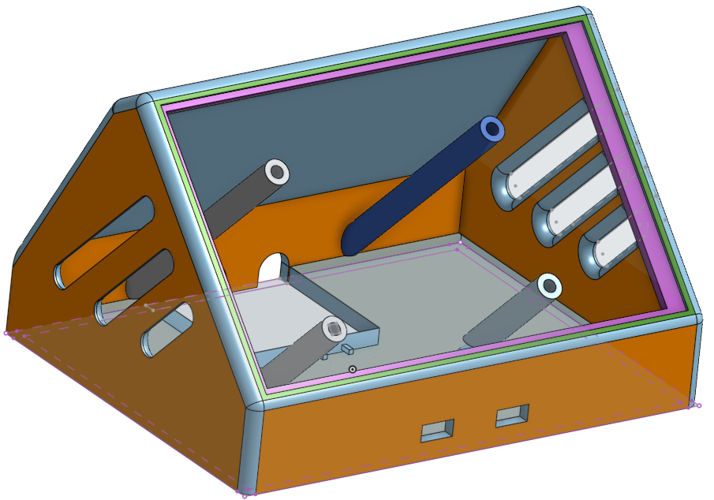
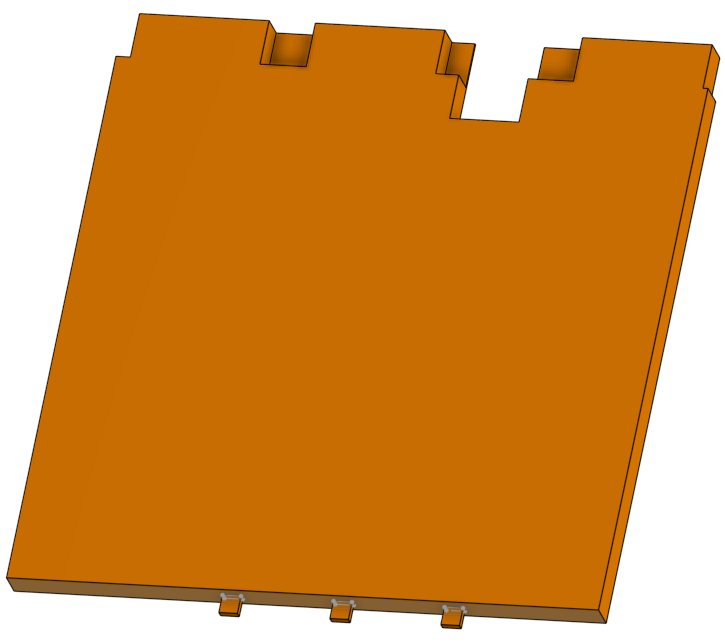
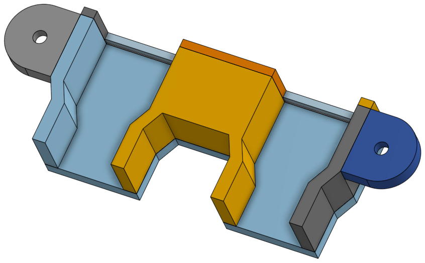

# Boîtier 3D — Station Blanche
{: .no_toc }

Design du boîtier imprimé en 3D pour la Station Blanche, réalisé avec **OnShape**.

---

## Composition

Le boîtier est constitué de **3 pièces** imprimées en 3D :

### Pièce 1 — Structure principale

### Pièce 2

### Pièce 3

---

## Fichier source

Le fichier CAO source (`boitier.sldprt`) est disponible dans ce dossier pour modification dans OnShape ou SolidWorks.
